## *Laying the foundation of success with OIC & ERP to disparate systems*

<p align="center">
  
</p>

This lab will show you the best way to start using OIC as an Oracle ERP customer by importing an already built integration to your environment. This does not show comprehensively every single step you need to follow; but with the guidance of an Oracle Cloud Engineer, or previous OIC experience, or the other referenced labs in this repo - you can go from 0 to 100 before your lunch hour.

## Introduction

Parts 1 - 3 use OIC as a 'drag & drop API builder'. You can use a blank REST adapter at the beginning of your integrations. In your integration tenancy, you should have a 'Sample REST endpoint' that you can use as the start of your app driven orchestration.

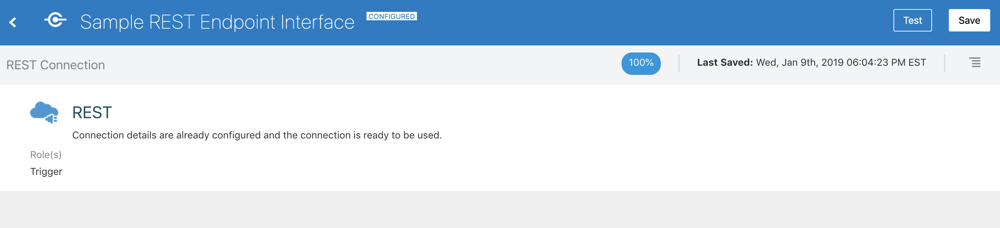

This can also be used to abstract away SOAP endpoints. These endpoints can also invoked from Postman, SOAP UI, VBCS, your given front end framework of choice, coding language API call, etc. You could also just directly call the API of the system you integrate with instead of using OIC, but then you miss the centralized logging capability of OIC and its other benefits.

[REST to database workshop](https://github.com/GaryHostt/ATPworkshop)
- This workshop is similar to what we do in parts 1 - 3, but OIC invokes a database instead of Cloud ERP. This [video explains that workshop](http://media.licdn.com/embeds/media.html?src=https%3A%2F%2Fwww.youtube.com%2Fembed%2F-9nP2LaeOok%3Ffeature%3Doembed&url=https%3A%2F%2Fwww.youtube.com%2Fwatch%3Fv%3D-9nP2LaeOok&type=text%2Fhtml&schema=youtube). You can do this lab for free with an ['always free' ATP database on your OCI tenancy](https://www.oracle.com/cloud/free/).

If you are brand new to Oracle Integration, you may consider doing one of the 'Beginner Workshops' [here](https://garyhostt.github.io/Oracle_Integration/).

For this workshop, you can download [Postman](https://www.postman.com/downloads/) or [test your integration inside of OIC](https://docs.oracle.com/en/cloud/paas/integration-cloud/integrations-user/testing-integration-instances.html#GUID-A00BF42A-9A4F-4984-8B54-B3896066C0B2). For hitting your integration endpoints from Postman, use basic auth and ensure your user has the necessary [IDCS role for OIC](https://docs.cloud.oracle.com/en-us/iaas/integration/doc/assigning-service-roles-oracle-integration.html), like how oicc0034 does.

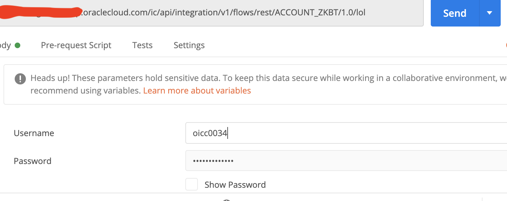

Lastly, this [video](https://www.youtube.com/watch?v=zZk6SI7FADY&feature=youtu.be) shows you a 10 minute walkthrough of OIC and an advanced ERP integration that takes advantage of starting with a REST adapter that invokes ERP, the basics of which will be explained in parts 1 - 2 of this workshop).

## Objectives

- Use the [Cloud ERP adapter](https://docs.oracle.com/en/cloud/paas/integration-cloud/erp-adapter/oracle-erp-cloud-adapter-capabilities.html#GUID-5ED9E9D5-66F4-4EAA-87D7-75BD405C1E07) in OIC
- Use the sample REST endpoint
- Explore where else you can go with ERP integrations

## Outline

- Create an Account in ERP
- Enable REST access for your ERP user
- Webhooks
- Trigger Adapters
- ERP Event integrations

## Part 1 - Create an Account in ERP

If you find there's a lack of sufficient details in Part 1, consult [this lab](https://github.com/GaryHostt/Fusion_PurchaseOrder_Integration/blob/master/README.md), where we create an Order in ERP in an identical fashion, but with more screenshots.

<a id="raw-url" href="https://github.com/GaryHostt/beginner_ERP_OIC/blob/master/REST_ERP_CREATE_ACCOUNT_01.00.0000.iar?raw=true">Download .iar integration export</a>

After you download the .iar, import it to your integration environment from the 'import' button on the top right of the integration design page.

Configure the imported connection to point to your ERP system, if you have problems you may need to follow some of these [prerequisites](
https://docs.oracle.com/en/cloud/paas/integration-cloud/erp-adapter/prerequisites-creating-connection.html#GUID-FEA17A38-60BF-482D-99CD-31DA9E6C9E77).

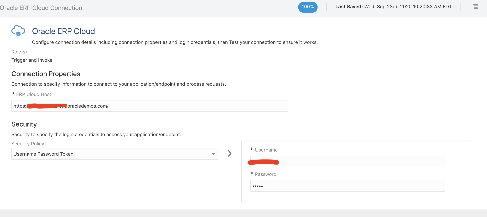

### Explanation of what's in the imported integration

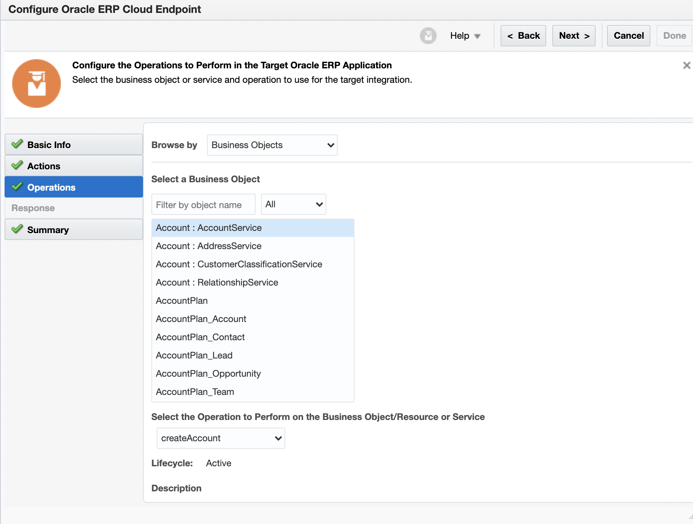

The selected operation on our ERP adapter is set to create an account. This is a sample payload that can be received by the starting REST adapter.

```
{"field1":"Trek Systems","field2":"15113","field3":"3047415022"}
```
You will get an error unless you increment field 2 each time you submit. Below are some errors you may get.

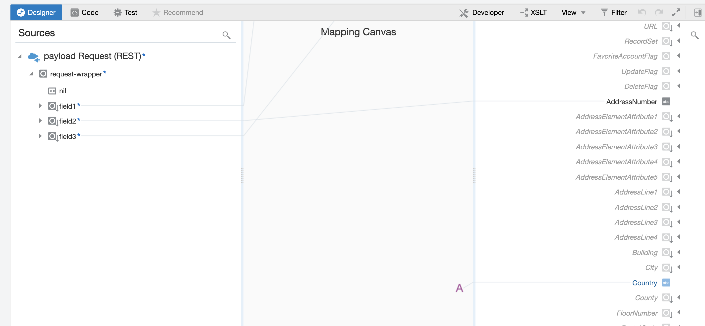
We map some fields to be inputs from fields 1-3, but some fields are hardcoded. You can add more fields to the REST adapter if you don't want to hardcode values. 

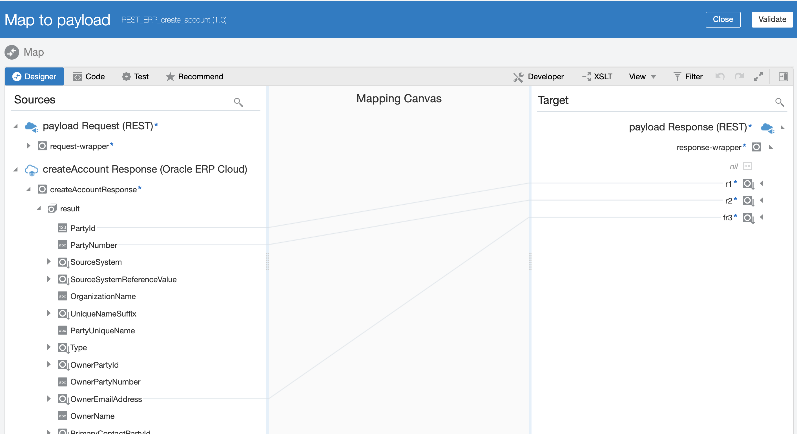

Here we map the response from ERP back to the REST endpoint. We get the PartyId, PartyNumber, and user that created the account as the response.

*Error 1: missing required field*

While making this integration or hitting a new object & service, you can learn the minimum required fields for those by looking for the field in the error. Below, you can see that OrganizationName is required.

```
JBO-27027: Missing mandatory attributes for a row with key oracle.jbo.Key[300000184853422 ] of type OrganizationDEOJBO-27014: Attribute OrganizationName in OrganizationDEO is required
```

**Before**

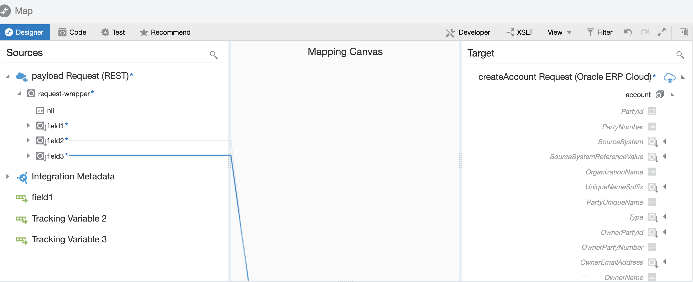

Here we can see that the OrganizationName isn't mapped, thus triggering the previous error.

**After**

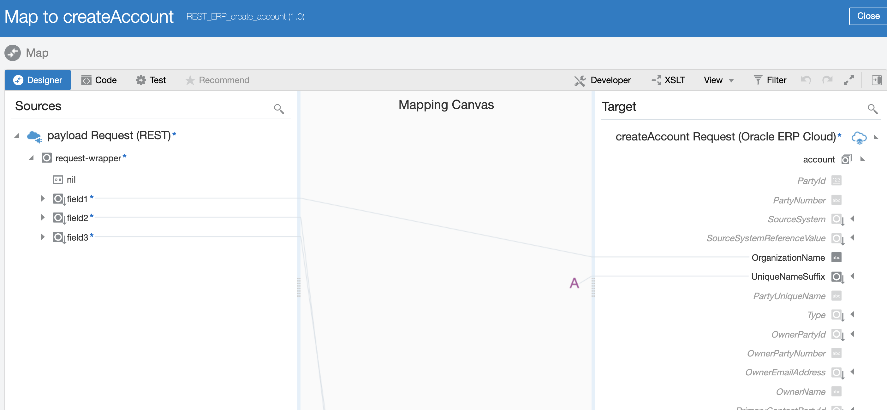

Now we can see the OrganizationName is mapped, thus fixing the previous error.

*Error 2: didn’t increment field 2*

You get this field if you do not increment field2, because it already exists after you create an account. 
```
JBO-27024: Failed to validate a row with key oracle.jbo.Key[300000184853360 ] in PartySiteEOJBO-FND:::FND_CMN_RCRD_VAL: <MESSAGE><NUMBER></NUMBER><TEXT>A record with the value 15113 already exists.
```
The screenshots below show you how to find these errors and troubleshoot within OIC.

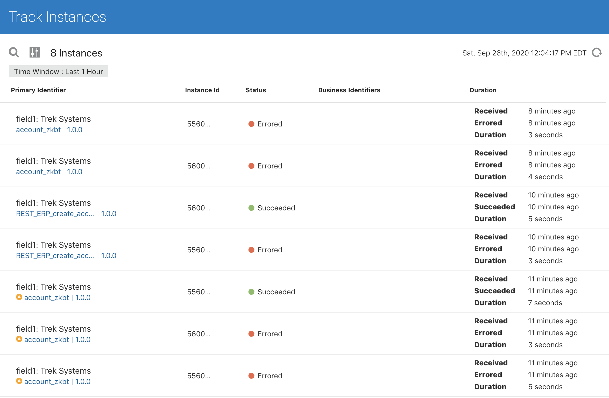
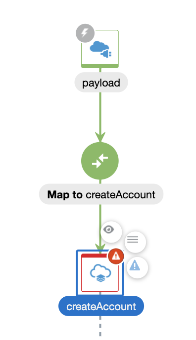
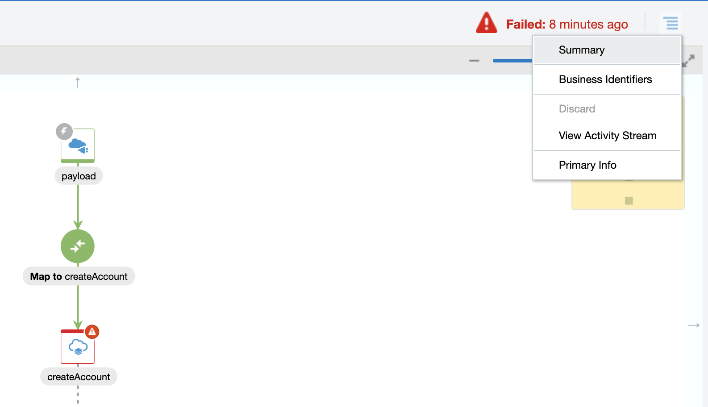

## Part 2 - Enable REST catalog for your ERP user

The user that you use in your adapter connection requires these [roles & privileges](https://docs.oracle.com/en/cloud/paas/integration-cloud/erp-adapter/prerequisites-creating-connection.html#GUID-B861559A-DECE-4F7B-82CA-AA48263CA159) in order to access the REST resources. This [blog](https://blogs.oracle.com/fmw/oracle-integration-cloud-oic-fusion-applications-security-requirements) provides screenshots on how to do this for your ERP user.

The advantage of gaining access to the REST resources is that those endpoints follow the [SaaS API documentation](https://docs.oracle.com/en/cloud/saas/index.html). For example, in the screenshot below you see the Cash Bank accounts endpoint - and that resource will follow [this documentation](
https://docs.oracle.com/en/cloud/saas/financials/20b/farfa/api-bank-accounts.html) exactly.

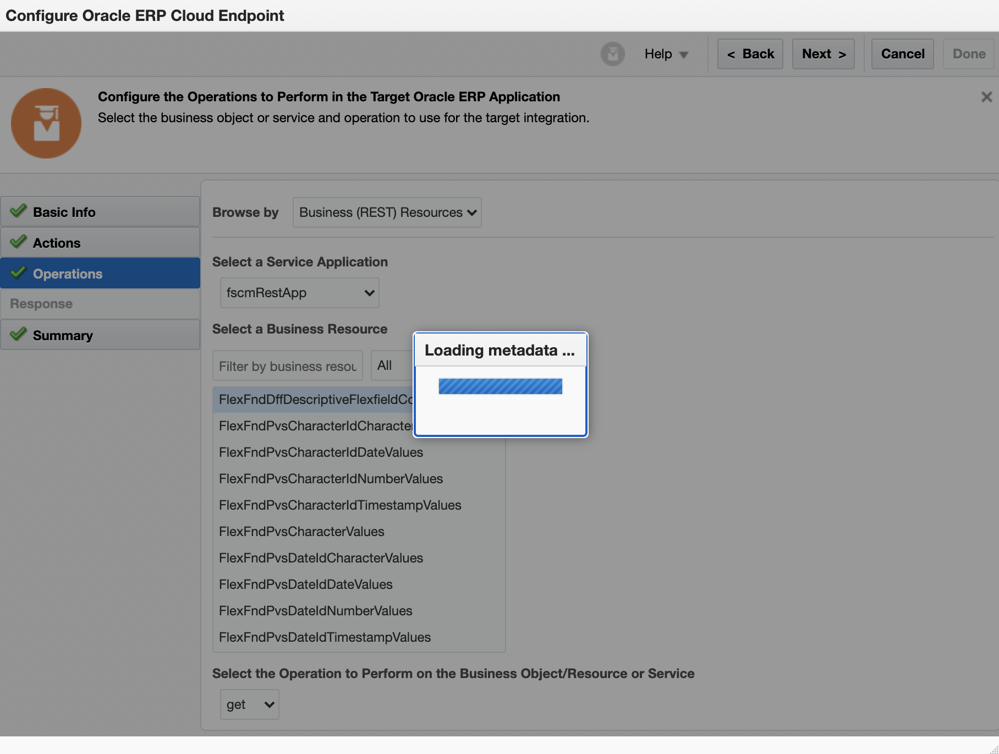

Select the 'fscmRestApp' to pull your ERP endpoints. If this is your first time, the 'Loading metadata' pop-up may take a couple minutes to finish. If you get a 500 error instead of seeing the REST resources, you need to apply the roles & privileges linked at the beginning of section 2.

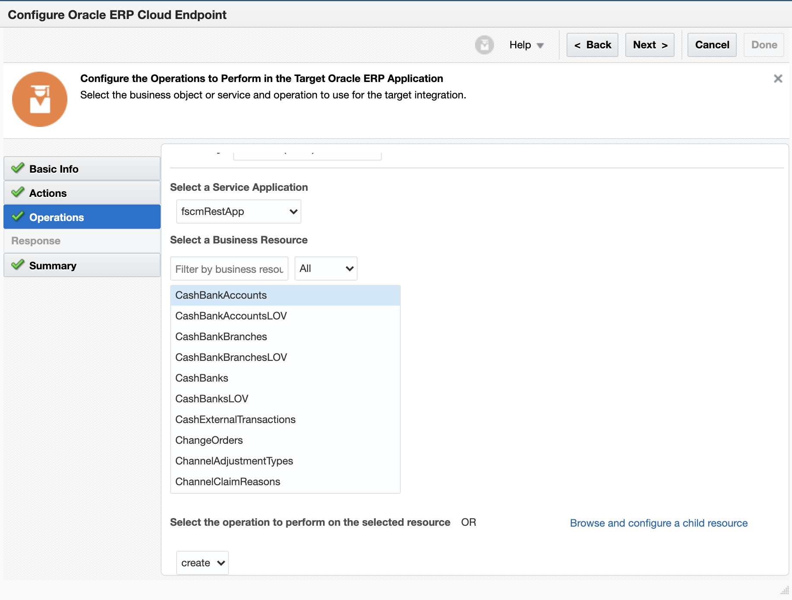

Here I have selected create on the CashBankAccount object, we can see how this endpoint works in the REST API docs, [here](https://docs.oracle.com/en/cloud/saas/financials/20b/farfa/api-bank-accounts.html).

## Part 3 - Webhook to OIC to ERP

[What is a webhook?](https://www.youtube.com/watch?v=rUaDIH5ZXB8)

For systems where we do not have an adapter, you can configure that system to use a webhook to hit integrations like the ones above. For example, a [JIRA webhook](https://developer.atlassian.com/server/jira/platform/webhooks/) that points to your endpoint would take the place of Postman in the previous work.

For your webhooks to fire to OIC from JIRA, you do not require using the REST adapter to authenticate to JIRA in OIC - you simply need to point JIRA to your integration, and add your authentication information (seen with the oicc0034 user previously).But, if you want to pass information back to JIRA, you can use the response part of the REST payload. 

Alternatively, if you want to pass information to JIRA from ERP in a real-time manner for other use cases, first you will need to use the REST adapter and [authenticate to the JIRA API](https://developer.atlassian.com/server/jira/platform/rest-apis/) to pass information to it. Then you can have an event in ERP trigger an integration that invokes your REST connection to JIRA and the relevant endpoint. 

## Part 4 - Replace webhooks w/ a Trigger Adapter

For systems where we have an adapter, we can take advantage of the trigger capabilities of those adapters rather than using a webhook & REST API.

[Configuring salesforce outbound events](https://www.youtube.com/watch?v=5Pq-Dme5Gvc&feature=share)

[Oracle Integration adapters](https://docs.oracle.com/en/cloud/paas/integration-cloud/find-adapters.html)

- Pick your adapter, on the left of the page look at 'Add your adapter to an integration' and you can see if that adapter supports event triggers.

## Part 5 - Configuring ERP Event integrations

One of OIC's best features are its Oracle SaaS adapters. They enable your integrations to listen for events from Fusion ERP after configuring the steps below, just once. After that, you can create event based integrations straight from the canvas without further configuration. Please follow Parts 1 & 2 to configure your ERP instance with your OIC instance. 

[Part 1](https://blogs.oracle.com/imc/subscribe-to-business-events-in-fusion-based-saas-applications-from-oracle-integration-cloud-oic-part-1-prerequisites)

[Part 2](https://www.ateam-oracle.com/using-business-events-with-integration-cloud-part-2)

[Supplemental to Part 1 & 2](https://www.techsupper.com/2020/03/subscribe-oracle-erp-business-events-in-oracle-integration.html)

The examples below are from workshops that will show you how to build an event based integration after you complete the pre-reqs above.

[Event based integration, example 1](https://github.com/GaryHostt/OIC_SaaS_integration/blob/master/Lab200.md)

[Event based integration, example 2](https://antonyjr.github.io/Hands-On-Labs/ERP-Integration-Patterns/html/erp-cloud-events-simple.html)

[Event based integration, example 3](https://github.com/GaryHostt/Fusion_PurchaseOrder_Integration/blob/master/README.md)

# Conclusion

You have now learned how to use OIC as a 'pseudo' API Gateway (click [here](https://www.oracle.com/cloud-native/api-gateway/) for 'real' APIGW), configure webhooks, and to take advantage of OIC's event listening capabilities. To learn more about what you can do with ERP & OIC, click [here](https://antonyjr.github.io/Hands-On-Labs/ERP-Integration-Patterns/html/index.html). To learn more about what you can do with OIC in general, click [here](https://garyhostt.github.io/Oracle_Integration/). For batch jobs with BICC, start [here](https://github.com/GaryHostt/Oracle_Integration/blob/master/Intro.md).
