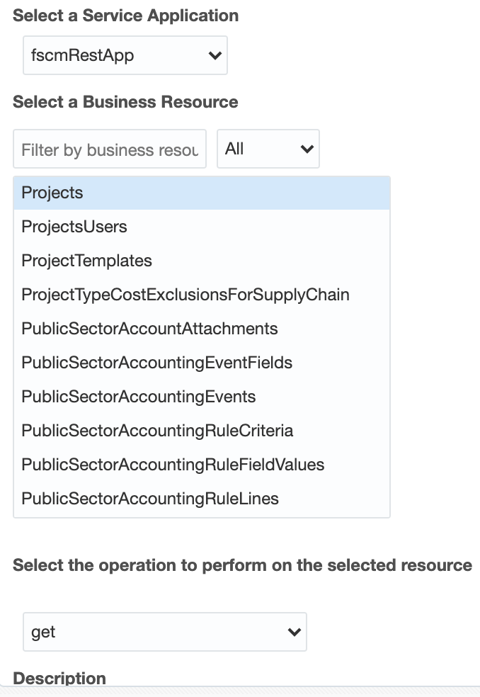
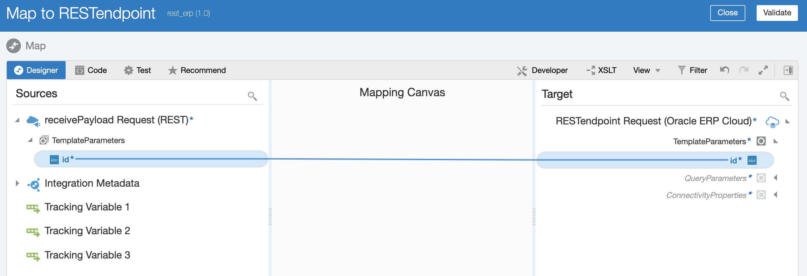
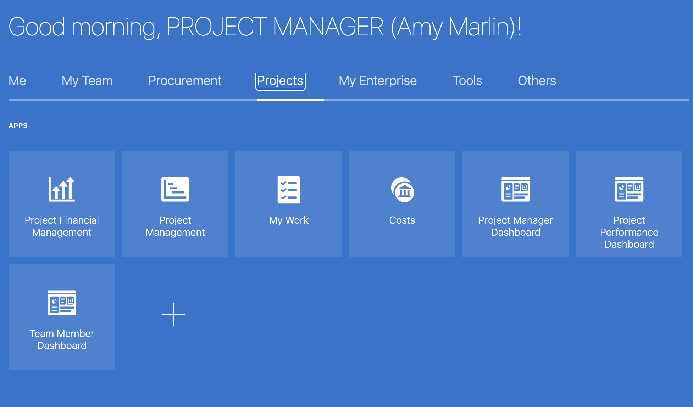
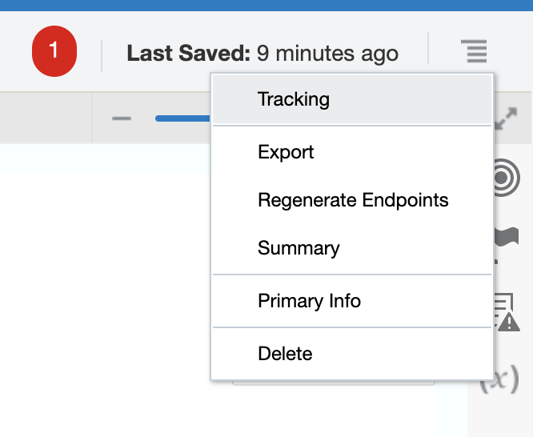
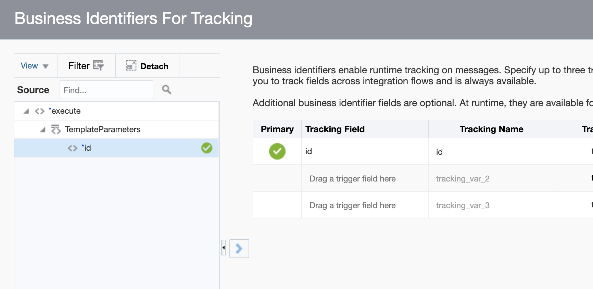

## *Laying the foundation of success with OIC & ERP to disparate systems*

<p align="center">
  
</p>

## Who this lab is for
- new ERP & OIC users
- current users looking for other use cases with ERP & OIC

In Part 1 of this lab you will start using OIC with Oracle ERP by importing an already built integration to your environment and then running it. **Note: if you do not have account or projects in your modules, these may not work for you.**

The sections afterwards elaborate on other use cases and any necessary configuration. This repo does not show comprehensively every single step you need to follow; but with the guidance of an Oracle Cloud Engineer, or previous OIC experience, or even solely the other referenced labs & material in this repo - you can go from 0 to 100 before your lunch hour.

For learning ERP generally, we have several how-to videos - such as for Financials [here](https://docs.oracle.com/en/cloud/saas/financials/20c/videos.html) or Project Management [here](https://docs.oracle.com/en/cloud/saas/project-management/20c/videos.html).

## Objectives

- Watch this [video](https://www.youtube.com/watch?v=zZk6SI7FADY&feature=youtu.be)
  - This shows you a 10 minute walkthrough of OIC and an advanced ERP integration that takes advantage of starting with a REST adapter that invokes ERP, the basics of which will be explained in parts 1 - 2 of this workshop). The links for how to do the content shown in that video are [here](https://csh-sm-tigerteam.github.io/PaaSForSaaS/?lab=lab-300a-connect) & [here](https://csh-sm-tigerteam.github.io/PaaSForSaaS/?lab=lab-300b-connect). Consider doing those labs to learn how to extend what you learn here with Process Automation in OIC.
- Use the [Cloud ERP adapter](https://docs.oracle.com/en/cloud/paas/integration-cloud/erp-adapter/oracle-erp-cloud-adapter-capabilities.html#GUID-5ED9E9D5-66F4-4EAA-87D7-75BD405C1E07) in OIC
  - this is from the official OIC documentation, more valuable knowledge at this hyperlink
- Use the sample REST endpoint
- Explore where else you can go with ERP integrations

## Outline

- App-driven/real-time integrations; Parts 1 - 5
  - Create an Account in ERP
    - download & import included .iar file
    - troubleshooting & how to create new use cases
  - Enable REST access for your ERP user
    - download & import included .iar file
  - Webhooks
  - Trigger Adapters
  - ERP Events
    - configuration, examples, troubleshooting
- Scheduled/batch integrations & VBCS; Parts 6 - 8
  - FBDI automation
  - Other scheduled integrations
  - Visual Builder embedding
- Conclusion
  
# App-driven/real-time integrations

## Introduction

Parts 1 - 3 use OIC as a 'drag & drop API builder'. You can use a blank REST adapter at the beginning of your integrations. In your integration tenancy, you should have a 'Sample REST endpoint' that you can use as the start of your app driven orchestration.


This can also be used to abstract away SOAP endpoints. These endpoints can also invoked from Postman, SOAP UI, VBCS, your given front end framework of choice, coding language API call, etc. You could also just directly call the API of the system you integrate with instead of using OIC, but then you miss the centralized logging capability of OIC and its other benefits.

[REST to database workshop](https://github.com/GaryHostt/ATPworkshop)
- This workshop is similar to what we do in parts 1 - 3, but OIC invokes a database instead of Cloud ERP. This [video explains that workshop](http://media.licdn.com/embeds/media.html?src=https%3A%2F%2Fwww.youtube.com%2Fembed%2F-9nP2LaeOok%3Ffeature%3Doembed&url=https%3A%2F%2Fwww.youtube.com%2Fwatch%3Fv%3D-9nP2LaeOok&type=text%2Fhtml&schema=youtube). You can do this lab for free with an ['always free' ATP database on your OCI tenancy](https://www.oracle.com/cloud/free/).

If you are brand new to Oracle Integration, you may consider doing one of the 'Beginner Workshops' [here](https://garyhostt.github.io/Oracle_Integration/) in [my](https://bit.ly/3lRd5e0) general OIC repository.

For this workshop, you can download [Postman](https://www.postman.com/downloads/) or [test your integrations inside of OIC](https://docs.oracle.com/en/cloud/paas/integration-cloud/integrations-user/testing-integration-instances.html#GUID-A00BF42A-9A4F-4984-8B54-B3896066C0B2). For hitting your integration endpoints from Postman, use basic auth and ensure your user has the necessary [IDCS role for OIC](https://docs.cloud.oracle.com/en-us/iaas/integration/doc/assigning-service-roles-oracle-integration.html), like how oicc0034 does.


## Part 1 - Create an Account in ERP

If you find there's a lack of sufficient details in Part 1, consult [this lab](https://github.com/GaryHostt/Fusion_PurchaseOrder_Integration/blob/master/README.md), where we create an Order in ERP in an identical fashion, but with more screenshots.

<a id="raw-url" href="https://github.com/GaryHostt/beginner_ERP_OIC/blob/master/REST_ERP_CREATE_ACCOUNT_01.00.0000.iar?raw=true">Download .iar integration export</a>

After you download the .iar, import it to your integration environment from the ['import' button on the top right of the integration design page](https://raw.githubusercontent.com/GaryHostt/beginner_ERP_OIC/master/screenshots/import2.png).

Configure the imported connection to point to your ERP system, if you have problems you may need to follow some of these [prerequisites](
https://docs.oracle.com/en/cloud/paas/integration-cloud/erp-adapter/prerequisites-creating-connection.html#GUID-FEA17A38-60BF-482D-99CD-31DA9E6C9E77).


### Explanation of what's in the imported integration 

This section shows how to use the running integration, troubleshooting its development & how to create new use cases of a similar pattern.


The selected operation on our ERP adapter is set to create an account. This is a sample payload that can be received by the starting REST adapter.

```
{"field1":"Trek Systems","field2":"15113","field3":"3101239876"}
```
You will get an error unless you increment field 2 each time you submit. Below are some errors you may get.


We map some fields to be inputs from fields 1-3, but some fields are hardcoded. You can add more fields to the REST adapter if you don't want to hardcode values. 


Here we map the response from ERP back to the REST endpoint. We get the PartyId, PartyNumber, and user that created the account as the response.

*Error 1: missing required field*

While making this integration or hitting a new object & service, you can learn the minimum required fields for those by looking for the field in the error. Below, you can see that OrganizationName is required. Going through each of these errors is how you make these from scratch, unless you consult the [Fusion App's SOAP/REST API documentation](https://docs.oracle.com/en/cloud/saas/index.html).

```
JBO-27027: Missing mandatory attributes for a row with key oracle.jbo.Key[300000184853422 ] of type OrganizationDEOJBO-27014: Attribute OrganizationName in OrganizationDEO is required
```

**Before**


Here we can see that the OrganizationName isn't mapped, thus triggering the previous error.

**After**


Now we can see the OrganizationName is mapped, thus fixing the previous error.

*Error 2: didn’t increment field 2*

You get this field if you do not increment field2, because it already exists after you create an account. 
```
JBO-27024: Failed to validate a row with key oracle.jbo.Key[300000184853360 ] in PartySiteEOJBO-FND:::FND_CMN_RCRD_VAL: <MESSAGE><NUMBER></NUMBER><TEXT>A record with the value 15113 already exists.
```
The screenshots below show you how to find these errors and troubleshoot within OIC. From the OIC Service Console home page, go to monitoring -> tracking or monitoring -> integrations. On tracking, click the black text with your tracking field to view that specific run. You can view errors on the activity stream, or by clicking the red connection and then the '!'.


## Part 2 - Enable REST catalog for your ERP user

The user that you use in your adapter connection requires these [roles & privileges](https://docs.oracle.com/en/cloud/paas/integration-cloud/erp-adapter/prerequisites-creating-connection.html#GUID-B861559A-DECE-4F7B-82CA-AA48263CA159) in order to access the REST resources. This [blog](https://blogs.oracle.com/fmw/oracle-integration-cloud-oic-fusion-applications-security-requirements) provides screenshots on how to do this for your ERP user.

The advantage of gaining access to the REST resources is that those endpoints follow the [SaaS API documentation](https://docs.oracle.com/en/cloud/saas/index.html). For example, in the screenshot below you see the Cash Bank accounts endpoint - and that resource will follow [this documentation](
https://docs.oracle.com/en/cloud/saas/financials/20b/farfa/api-bank-accounts.html) exactly.


Select the 'fscmRestApp' to pull your ERP endpoints. If this is your first time, the 'Loading metadata' pop-up may take a couple minutes to finish. If you get a 500 error instead of seeing the REST resources, you need to apply the roles & privileges linked at the beginning of section 2.


Here I have selected create on the CashBankAccount object, we can see how this endpoint works in the REST API docs, [here](https://docs.oracle.com/en/cloud/saas/financials/20b/farfa/api-bank-accounts.html).

You can also invoke BIP in a similar fashion as shown [here](https://antonyjr.github.io/Hands-On-Labs/ERP-Integration-Patterns/html/erp-cloud-bip-report-simple.html#Background).

### Explanation of the imported integration

<a id="raw-url" href="https://github.com/GaryHostt/beginner_ERP_OIC/blob/master/REST_ERP_GETPROJECT_01.00.0000.iar?raw=true">Download .iar integration export</a>

You can find the ProjectId for your projects by calling [this endpoint](https://docs.oracle.com/en/cloud/saas/project-management/20b/fapap/op-projects-get.html) against your Fusion REST API. We will need to get one 'ProjectId' from that response to input as a query parameter to the integration. 

[This endpoint](https://docs.oracle.com/en/cloud/saas/project-management/20b/fapap/op-projects-projectid-get.html) is the one our integration is calling, it gets one specific project and its relevant information.

Here, this is the choosen action on the ERP adapter on the integration canvas. 



Below, you can see that we map the id parameter from the REST adapter to the id parameter input on the ERP connection.



You may also be able to find your ProjectId from the Fusion API.



Lastly, don't forget your tracking field or you won't be able to activate your integration.




My response fields receive the BusinessUnitID, Business Unit name, and External Project ID. If you receive empty "" in your response, that means that field doesn't have data for that project in your ERP.

## Part 3 - Webhook to OIC to ERP

[What is a webhook?](https://www.youtube.com/watch?v=rUaDIH5ZXB8)

For systems where we do not have an adapter, you can configure that system to use a webhook to hit integrations like the ones above. For example, a [JIRA webhook](https://developer.atlassian.com/server/jira/platform/webhooks/) that points to your endpoint would take the place of Postman in the previous work.

For your webhooks to fire to OIC from JIRA, you do not require using the REST adapter to authenticate to JIRA in OIC - you simply need to point JIRA to your integration, and add your authentication information (seen with the oicc0034 user previously). But, if you want to pass information back to JIRA, you can use the response part of the REST payload. 

Alternatively, if you want to pass information to JIRA from ERP in a real-time manner for other use cases, first you will need to use the REST adapter and [authenticate to the JIRA API](https://developer.atlassian.com/server/jira/platform/rest-apis/) to pass information to it. Then you can have an event in ERP trigger an integration that invokes your REST connection to JIRA and the relevant endpoint. 

## Part 4 - Replace webhooks w/ Trigger Adapters

For systems where we have an adapter, we can take advantage of the trigger capabilities of those adapters rather than using a webhook & REST adapter at the start of the integration.

[Oracle Integration adapters](https://docs.oracle.com/en/cloud/paas/integration-cloud/find-adapters.html)

- Pick your adapter, on the left of the page look at 'Add your adapter to an integration' and you can see if that adapter supports event triggers. Typically, the given SaaS will require some configuration on its end to 'aim' its message(s) to OIC. Those processes are in the official documenation above in the pre-reqs section for each adapter.

[Video on configuring salesforce outbound events with OIC](https://www.youtube.com/watch?v=5Pq-Dme5Gvc&feature=share)

- For example, with salesforce you will need a different workflow rule to trigger the necessary outbound configuration. This is different from Oracle ERP/Fusion apps, where after you perform the configuration below once - new event based integrations will be registered to your SaaS after you create the event based integrations in your OIC environment.

## Part 5 - ERP Event integrations

### Configuration

One of OIC's best features are its Oracle SaaS adapters. They enable your integrations to listen for events from Fusion ERP after configuring the steps below, just once. After that, you can create event based integrations straight from the canvas without further configuration. Please follow Parts 1 & 2 to configure your ERP instance with your OIC instance. 

[Part 1](https://blogs.oracle.com/imc/subscribe-to-business-events-in-fusion-based-saas-applications-from-oracle-integration-cloud-oic-part-1-prerequisites) & [Part 2](https://www.ateam-oracle.com/using-business-events-with-integration-cloud-part-2)

[Supplemental material](https://www.techsupper.com/2020/03/subscribe-oracle-erp-business-events-in-oracle-integration.html)

### Examples

These are workshops that will show you how to build various event based integrations after you complete the pre-reqs above.

[Walkthrough 1](https://github.com/GaryHostt/OIC_SaaS_integration/blob/master/Lab200.md)

[Walkthrough 2](https://antonyjr.github.io/Hands-On-Labs/ERP-Integration-Patterns/html/erp-cloud-events-simple.html)

[Walkthrough 3](https://github.com/GaryHostt/Fusion_PurchaseOrder_Integration/blob/master/README.md)

I don't have this documented - but you could even have your ERP fire Invoice or other payment events, where upon their CRUD - those transactions are sent to [Oracle Blockchain Platform](https://docs.oracle.com/en/cloud/paas/blockchain-cloud/rest-api/api-application-operations-transactions.html). Or you could have events sent to [a Kafka topic via OIC](https://docs.oracle.com/en/cloud/paas/integration-cloud/apache-kafka-adapter/produce-messages-apache-kafka-topic.html).

### Troubleshooting

You can see the events available to be captured by OIC by calling the REST API of your Fusion instance, using a GET at this endpoint:
```
<base_url>/soa-infra/PublicEvent/catalog
```
You can see your subscripted event integrations by calling a GET at this endpoint:
```
/soa-infra/PublicEvent/subscriptions
```
If you do not see the CSF key you created in parts 1, nor the endpoint url for your integration - OIC will not capture the event. You may have used incorrect credentials when creating the key, or your integration is not active. 

You can delete your subscribed OIC instances by calling this endpoint with a DELETE verb & relevant id. The id is part of the response from the above endpoint.
```
/soa-infra/PublicEvent/subscriptions/{id}
```
You can also [create your own custom events](https://docs.oracle.com/en/cloud/paas/integration-cloud/erp-adapter/prerequisites-creating-connection.html#GUID-2C7EE4B5-BF8D-4802-8C61-C542C932C3B0) using the application composer. 

# Scheduled Orchestrations/Batch Integrations

## Part 6 - FBDI with scheduled orchestrations

[Generate FBDI file](https://docs.oracle.com/en/solutions/import-data-for-enterprise-resource-planning/generate-file-based-data-import-fbdi-file.html#GUID-1E0C5148-30F1-4FD8-B667-874170143467)

[Video of how to do FBDI](https://www.youtube.com/watch?v=v5tAIKRgD4g)

[Getting job name & parameters](https://blogs.oracle.com/fmw/oracle-integration-and-erp-cloud-how-to-get-job-name-and-parameters-of-erp-bulk-import-jobs)

### OIC & FBDI

[FBDI workshop 1](https://github.com/maldu23/Fusion-FBDI-Integration/blob/master/FBDI_Wkshp.md)

[FBDI workshop 2](https://antonyjr.github.io/Hands-On-Labs/ERP-Integration-Patterns/html/erp-cloud-fbdi-import-simple.html)

[Using the OIC File server with FBDI & the FTP adapter](https://github.com/GaryHostt/Oracle_Integration/blob/master/Intro.md)

[Video of simple FBDI on OIC](https://www.youtube.com/watch?v=CjWhWg0WXeQ&t=436s)

[File integration best practicies](https://blogs.oracle.com/fmw/oracle-integration-cloud-oic-file-based-integration-best-practices) & [part 2](https://www.ateam-oracle.com/integration-cloud-file-handling-primer)


## Part 7 - Other scheduled integrations

[Alternative implementation using flat files & REST API](https://github.com/GaryHostt/BigQueryIntegration)

- For developers less familiar with FBDI. An alternative pattern could be having OIC simply read the given flat file, and then uploads its contents via the given target system's REST API, such as what is shown in the above 'alternative implmentation' where a flat file is uploaded via REST API in a scheduled orchestration. You can also do the reverse where you periodically poll given REST endpoint(s) in SaaS, and then create a file flat from the responses that is sent to FTP and/or object storage.

[Cloud Extracts lab](https://antonyjr.github.io/Hands-On-Labs/ERP-Integration-Patterns/html/erp-cloud-extracts-simple.html)

Lastly, you can also just send the file to the ERP UCM server, without invoking the FBDI job. 

## Part 8 - Visual builder embedding with SaaS

[Decision tree for embedding with SaaS](https://docs.oracle.com/en/solutions/integration-options-saas-cloud/index.html#GUID-3FDAF35E-5E41-41B4-8F15-819518D842CC)

[VBCS with SaaS](https://docs.oracle.com/en/solutions/extend-saas-cloud-native/index.html#GUID-B1C4064D-C47E-4277-93F0-C004F6CF1C00)

- you will need the OIC Service Admin role if using VBCS in OIC

[Youtube video for embedding VBCS in Cloud Appliactions](https://www.youtube.com/watch?v=5EfnDzfS-84)

- great Youtube channel for Visual Builder as well

# Conclusion

You have now learned how to use OIC as a 'pseudo' API Gateway (click [here](https://www.oracle.com/cloud-native/api-gateway/) for 'real' APIGW - which can also be used with OIC), configure webhooks, and to take advantage of OIC's event listening capabilities. To learn more about what you can do with ERP & OIC, click [here](https://antonyjr.github.io/Hands-On-Labs/ERP-Integration-Patterns/html/index.html). To learn more about what you can do with OIC in general, click [here](https://garyhostt.github.io/Oracle_Integration/). For batch jobs with [BICC](https://docs.oracle.com/en/cloud/saas/applications-common/r13-update17d/biacc/toc.htm), start [here](https://github.com/GaryHostt/Oracle_Integration/blob/master/Intro.md).
